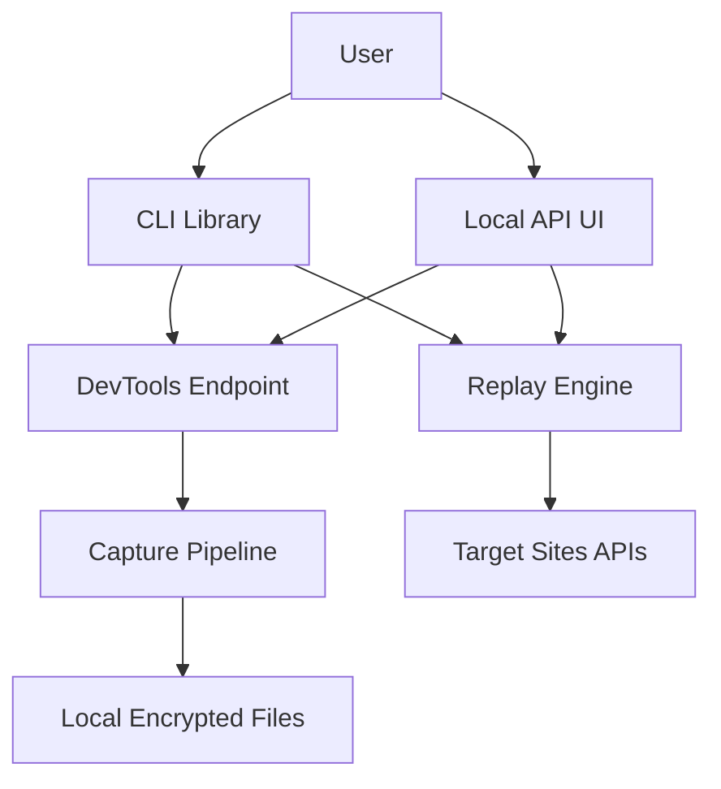

## Executive summary
CookieMonster is a local-first CLI/library/API for capturing browser auth headers via Chrome DevTools and replaying HTTP requests. The highest-risk themes are credential/token exposure through local files and API responses, unsafe local API exposure if bound off-loopback, and misuse of replayed credentials against unintended targets. Recent hardening reduced risk by enforcing loopback binds by default, validating UI URLs, redacting replay config secrets, and adding body-size limits.

## Scope and assumptions
In scope:
- `/Users/brianfong/Repos/CookieMonster/cookie_monster/`
- `/Users/brianfong/Repos/CookieMonster/tests/`
- `/Users/brianfong/Repos/CookieMonster/pyproject.toml`

Out of scope:
- Browser vendor internals (Chrome/Edge), OS kernel protections, user endpoint compromise response.
- Third-party service auth/session models (GitHub, Supabase, Gmail).

Assumptions:
- Primary deployment is local developer workstation usage, not internet-facing service.
- Users run only against accounts/systems they are authorized to access.
- Captured data can include highly sensitive cookies and bearer tokens.
- Local machine may host untrusted same-user processes.

Open questions that could materially change ranking:
- Is API/UI ever intentionally exposed to LAN/remote hosts in production use?
- Are encrypted capture/key files placed on shared disks or synced folders?
- Is this used in CI runners with shared execution contexts?

## System model
### Primary components
- CLI entrypoint and command router: `/Users/brianfong/Repos/CookieMonster/cookie_monster/cli.py` (`main`, `build_parser`)
- DevTools target discovery + websocket client: `/Users/brianfong/Repos/CookieMonster/cookie_monster/chrome_discovery.py`, `/Users/brianfong/Repos/CookieMonster/cookie_monster/cdp.py`
- Capture pipeline to JSONL/encrypted JSONL: `/Users/brianfong/Repos/CookieMonster/cookie_monster/capture.py`, `/Users/brianfong/Repos/CookieMonster/cookie_monster/storage.py`, `/Users/brianfong/Repos/CookieMonster/cookie_monster/crypto.py`
- Replay engine over HTTP: `/Users/brianfong/Repos/CookieMonster/cookie_monster/replay.py`
- Local API/UI server: `/Users/brianfong/Repos/CookieMonster/cookie_monster/api_server.py`, `/Users/brianfong/Repos/CookieMonster/cookie_monster/ui.py`
- Library wrapper/policy: `/Users/brianfong/Repos/CookieMonster/cookie_monster/client.py`, `/Users/brianfong/Repos/CookieMonster/cookie_monster/policy.py`

### Data flows and trust boundaries
- User shell/UI -> CLI/API server  
  Data: command args, URLs, paths, encryption key references.  
  Channel: local process args / local HTTP.  
  Guarantees: none by default; trust on local user context.  
  Validation: argparse typing in CLI; JSON parsing and URL validation in API (`_validate_http_url`).
- CLI/API server -> Browser DevTools endpoint  
  Data: CDP commands/events, request headers incl. auth material.  
  Channel: HTTP discovery + websocket CDP.  
  Guarantees: local binding expectation only.  
  Validation: target filtering (`target_hint`, host/path/method/resource filters).
- Capture pipeline -> Local filesystem  
  Data: captured headers/tokens in JSONL (plaintext or Fernet-encrypted).  
  Channel: local file I/O.  
  Guarantees: optional encryption; key stored locally by UI mode.  
  Validation: encrypted lines prefixed with `ENC:` and decrypted only with key.
- Replay engine -> Target website/API  
  Data: copied auth headers + optional body/json.  
  Channel: outbound HTTPS/HTTP via `requests`.  
  Guarantees: host-matching check + optional allowlist/policy.  
  Validation: `enforce_capture_host`, `allowed_domains`, policy deny rules.

#### Diagram

## Assets and security objectives
| Asset | Why it matters | Security objective (C/I/A) |
|---|---|---|
| Captured cookies/bearer tokens | Direct account/session takeover if leaked | C |
| Encryption key material | Decrypts captured auth cache | C |
| Replay target integrity | Prevents sending valid auth headers to attacker-controlled hosts | I/C |
| Capture/replay files | Can be tampered to alter replay behavior | I |
| Local API availability | Needed for UI workflows; abuse can block automation | A |

## Attacker model
### Capabilities
- Malicious local process on same machine/user context can send HTTP requests to local API if reachable.
- Operator error (misconfiguration) can expose API beyond loopback.
- Attacker can coerce replay against unintended domains if guards are disabled or misused.

### Non-capabilities
- No assumed kernel/admin compromise.
- No assumed break of Fernet cryptography.
- No assumed compromise of third-party web services themselves.

## Entry points and attack surfaces
| Surface | How reached | Trust boundary | Notes | Evidence (repo path / symbol) |
|---|---|---|---|---|
| CLI commands | Terminal invocation | User -> CLI | Broad control over capture/replay options | `/Users/brianfong/Repos/CookieMonster/cookie_monster/cli.py` `build_parser` |
| Local API `POST /capture` | HTTP to local server | Local process -> API server | Triggers capture and emits sample payload | `/Users/brianfong/Repos/CookieMonster/cookie_monster/api_server.py` `do_POST` |
| Local API `POST /replay` | HTTP to local server | Local process -> replay engine | Sends authenticated outbound request | `/Users/brianfong/Repos/CookieMonster/cookie_monster/api_server.py` `do_POST` |
| UI cache endpoints | HTTP to `/ui/*` | Local process -> browser session/capture | Launches browser profile and captures auth | `/Users/brianfong/Repos/CookieMonster/cookie_monster/api_server.py` `/ui/cache-auth` |
| Capture file loading | `replay`, `session-health`, `diff` | File system -> parser | Decrypt/parse untrusted local file content | `/Users/brianfong/Repos/CookieMonster/cookie_monster/storage.py` `load_captures` |

## Top abuse paths
1. Expose local API to network -> attacker calls `/replay` -> tool sends authenticated requests -> account/session abuse.
2. Steal UI key file + encrypted captures -> decrypt tokens offline -> replay sessions elsewhere.
3. User disables host enforcement -> replay to attacker-controlled endpoint -> credential/header exfiltration.
4. Oversized/abusive API body floods local server -> memory/CPU pressure -> local DoS.
5. Capture broad headers with `include_all_headers` -> sensitive non-auth headers persisted -> larger blast radius on leak.
6. Malicious local process repeatedly triggers `/ui/cache-auth` -> captures and inventories active auth state.

## Threat model table
| Threat ID | Threat source | Prerequisites | Threat action | Impact | Impacted assets | Existing controls (evidence) | Gaps | Recommended mitigations | Detection ideas | Likelihood | Impact severity | Priority |
|---|---|---|---|---|---|---|---|---|---|---|---|---|
| TM-001 | Local or remote actor (if misbound) | API exposed off loopback or local malware present | Calls API endpoints to drive capture/replay | Unauthorized use of active session auth | Tokens, replay integrity | Loopback-only enforcement by default (`_enforce_local_bind`) in `/Users/brianfong/Repos/CookieMonster/cookie_monster/api_server.py` | Optional remote override can still expose unauthenticated API | Add API auth token/mTLS for remote mode; disable remote override in production profile | Log source IP + endpoint + target host; alert on non-loopback access | Medium | High | high |
| TM-002 | Same-user local attacker | Read access to `~/.cookie_monster/ui/` | Reads key + encrypted capture, decrypts tokens | Session hijack/token exfiltration | Tokens, encryption keys | Fernet encryption (`encrypt_text`/`decrypt_text`) and key file chmod in `/Users/brianfong/Repos/CookieMonster/cookie_monster/crypto.py` | Key and ciphertext colocated; no OS keychain integration | Use OS keychain/keyring backend; optional passphrase-derived key; key rotation workflow | Audit key creation/use events; warn on weak file perms | Medium | High | high |
| TM-003 | Operator misuse / malicious automation | `--no-enforce-capture-host` or broad allowlist | Replays captured headers to unintended host | Credential leakage and unauthorized calls | Replay target integrity, tokens | Host equality guard + allowlist checks in `/Users/brianfong/Repos/CookieMonster/cookie_monster/replay.py`, `/Users/brianfong/Repos/CookieMonster/cookie_monster/security_utils.py`, policy in `/Users/brianfong/Repos/CookieMonster/cookie_monster/policy.py` | Safety controls are user-overridable and policy optional in CLI | Add mandatory confirmation gate for host override; persist trusted target profile; default deny when override is set without allowlist | Emit structured replay audit log including capture host vs request host | Medium | High | high |
| TM-004 | Local attacker/process | Can send large/invalid HTTP payloads to API | Memory/CPU abuse via oversized request bodies | Local denial of service | Local API availability | Body size cap (`MAX_JSON_BODY_BYTES`) and JSON parse error handling in `/Users/brianfong/Repos/CookieMonster/cookie_monster/api_server.py` | No request rate limiting/backpressure | Add per-IP rate limiting and request timeout envelope | Track request sizes and 4xx/5xx spikes | Low | Medium | medium |
| TM-005 | Local observer/log consumer | Access to API responses or logs | Reads sensitive config/token fields in responses | Secrets disclosure | Encryption key material | Replay config key redaction (`_safe_replay_config`) in `/Users/brianfong/Repos/CookieMonster/cookie_monster/api_server.py`; header redaction helper in `/Users/brianfong/Repos/CookieMonster/cookie_monster/security_utils.py` | Some endpoints still return capture samples that may include sensitive headers unless caller redacts | Add `redact_output=true` default in API responses for capture samples | Add tests asserting no sensitive headers in API response payloads | Medium | Medium | medium |

## Criticality calibration
For this repo, severity is driven by credential exposure and replay misuse potential:
- `critical`: unauthenticated remote path that reliably exfiltrates active auth tokens at scale; replay bypass that sends tokens cross-tenant automatically.
- `high`: local/near-local path enabling session takeover or unauthorized replay with modest prerequisites (TM-001, TM-002, TM-003).
- `medium`: local DoS or partial sensitive metadata leakage without direct token theft (TM-004, TM-005).
- `low`: minor information disclosure or misuse requiring unlikely preconditions and yielding low-impact outcomes.

## Focus paths for security review
| Path | Why it matters | Related Threat IDs |
|---|---|---|
| `/Users/brianfong/Repos/CookieMonster/cookie_monster/api_server.py` | Highest concentration of unauthenticated local HTTP surfaces and UI capture orchestration | TM-001, TM-004, TM-005 |
| `/Users/brianfong/Repos/CookieMonster/cookie_monster/replay.py` | Core credential replay logic and host/domain safeguards | TM-003 |
| `/Users/brianfong/Repos/CookieMonster/cookie_monster/security_utils.py` | Domain enforcement and sensitive header redaction primitives | TM-003, TM-005 |
| `/Users/brianfong/Repos/CookieMonster/cookie_monster/crypto.py` | Encryption/decryption and key file lifecycle | TM-002 |
| `/Users/brianfong/Repos/CookieMonster/cookie_monster/storage.py` | Persistent storage format and encrypted/plaintext handling | TM-002 |
| `/Users/brianfong/Repos/CookieMonster/cookie_monster/capture.py` | Captures high-value auth material and controls scope filters | TM-002, TM-005 |
| `/Users/brianfong/Repos/CookieMonster/cookie_monster/cli.py` | Exposes override flags that can weaken security posture | TM-003 |
| `/Users/brianfong/Repos/CookieMonster/cookie_monster/client.py` | Programmatic integration point where policy hooks may be bypassed by consumers | TM-003 |

## Quality check
- Entry points covered: CLI, local API endpoints, UI capture/check/inspect endpoints, file loaders.
- Trust boundaries represented in threats: local user/process, local API, DevTools, filesystem, outbound replay.
- Runtime vs CI/dev separation: report focuses runtime code paths; build/dev tooling excluded from threat ranking.
- User clarifications: none in this pass; assumptions listed explicitly.
- Assumptions/open questions: documented in scope section and reflected in priority rationale.
